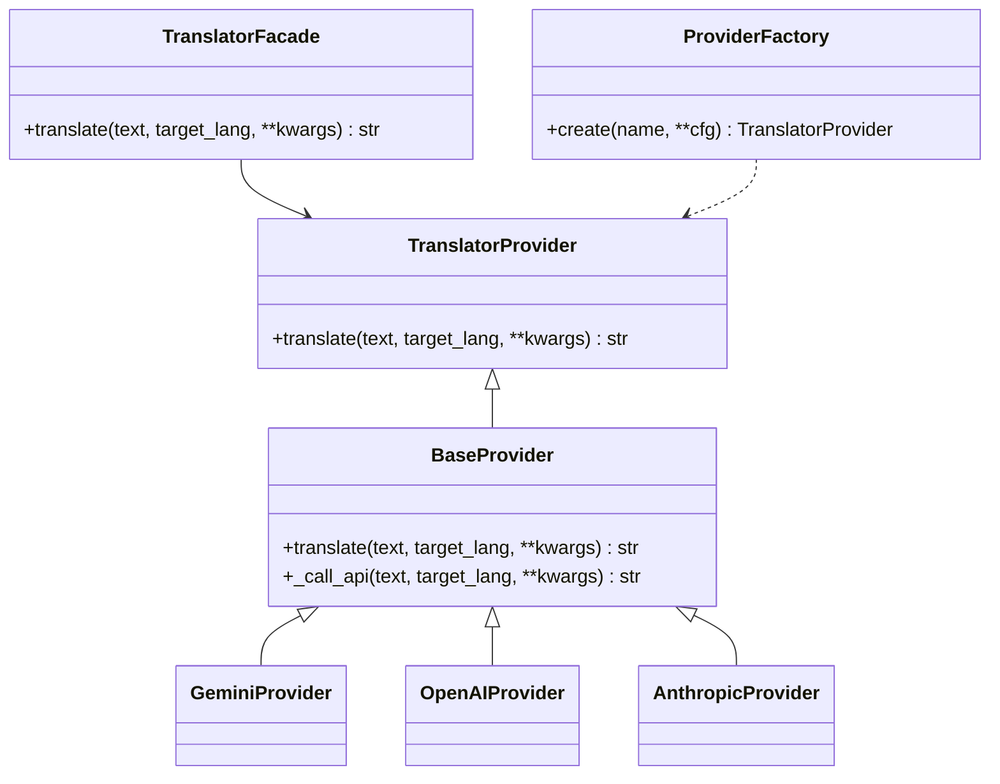
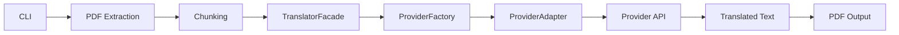

# Architecture (multi-provider AI)

This document proposes an architecture to support multiple AI providers
(Gemini, OpenAI, Anthropic, etc.) with a clean, extensible design that keeps
the current CLI pipeline intact.

## Goals
- Add a provider without changing the pipeline core.
- Normalize different APIs behind a single interface.
- Keep chunking, retry, OCR, layout, and PDF logic shared.
- Enable provider selection via CLI (e.g. `--provider gemini`).

## Recommended patterns
- Strategy: a single `TranslatorProvider` interface.
- Adapter: each provider maps its API to that interface.
- Factory + Registry: create providers by name.
- Template Method: shared retry/backoff in a base class.
- Facade: CLI talks to a single facade, not individual providers.

## High-level view

```text
CLI -> Pipeline -> TranslatorFacade -> ProviderFactory -> ProviderAdapter
         |                               ^
         v                               |
     PDF Extract + OCR + Layout      ProviderRegistry
```

## Components

### 1) Common interface (Strategy)
```python
class TranslatorProvider:
    def translate(self, text: str, target_lang: str, **kwargs) -> str:
        raise NotImplementedError
```

### 2) Provider adapters
Each provider implements the shared interface.

```python
class GeminiProvider(TranslatorProvider):
    def translate(self, text: str, target_lang: str, **kwargs) -> str:
        # Call Gemini API and return translated text
        ...
```

### 3) Registry + Factory
```python
ProviderRegistry = {
    "gemini": GeminiProvider,
    "openai": OpenAIProvider,
    "anthropic": AnthropicProvider,
}

def create_provider(name: str, **cfg) -> TranslatorProvider:
    return ProviderRegistry[name](**cfg)
```

### 4) Template Method (optional but useful)
```python
class BaseProvider(TranslatorProvider):
    def translate(self, text: str, target_lang: str, **kwargs) -> str:
        # Shared retry + backoff + logging
        return self._call_api(text, target_lang, **kwargs)

    def _call_api(self, text: str, target_lang: str, **kwargs) -> str:
        raise NotImplementedError
```

### 5) Translation facade
The CLI talks to a single facade.
```python
class TranslatorFacade:
    def __init__(self, provider: TranslatorProvider):
        self.provider = provider

    def translate(self, text: str, target_lang: str, **kwargs) -> str:
        return self.provider.translate(text, target_lang, **kwargs)
```

## Processing flow (text PDF)

```text
PDF -> extract_text -> chunk_text -> translate (provider) -> write_pdf
```

## Processing flow (soft layout)

```text
PDF -> extract_layout_blocks -> translate per block -> write_pdf_layout
```

## Sequence diagram (simplified)

```text
CLI
 |  parse args
 v
Pipeline
 |  extract text / layout
 |  chunk text
 v
TranslatorFacade
 |  translate(...)
 v
ProviderAdapter (Gemini/OpenAI/Anthropic)
 |  call API
 v
Translated output -> PDF
```

## Class diagram (Mermaid)



## Flow diagram (Mermaid)



## Design notes
- Providers should be as stateless as possible.
- Chunking remains shared across providers.
- Errors and retries live in the base class.
- Provider selection is configuration-driven (CLI/env).

## Future extensions
- Plugin system (entry points) for external providers.
- Translation cache per chunk.
- Batch mode with provider rate limits.
